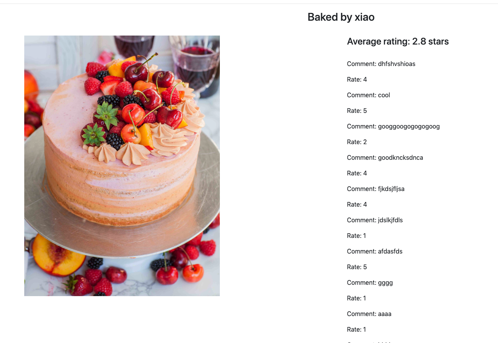

# rate-cakes

Created an application that allowed users to submit pictures of cakes. 

•	All cakes can be viewed, rated from 1-5 stars, and commented upon. 
•	When a cake image is clicked, the nested details component shows the cake image, the baker, the average rating, and all the different ratings and comments. 
•	Users have full CRUD privileges for all Cakes. 
•	Used Angular Frontend Framework, Node server with Express Framework for the backend and saved the data to a MongoDB with a RESTful API. 
•	Technologies: HTML5, CSS, Bootstrap, and JavaScript.
•	Include backend validations.
•	Include a search bar to display the cakes only by a certain baker.

